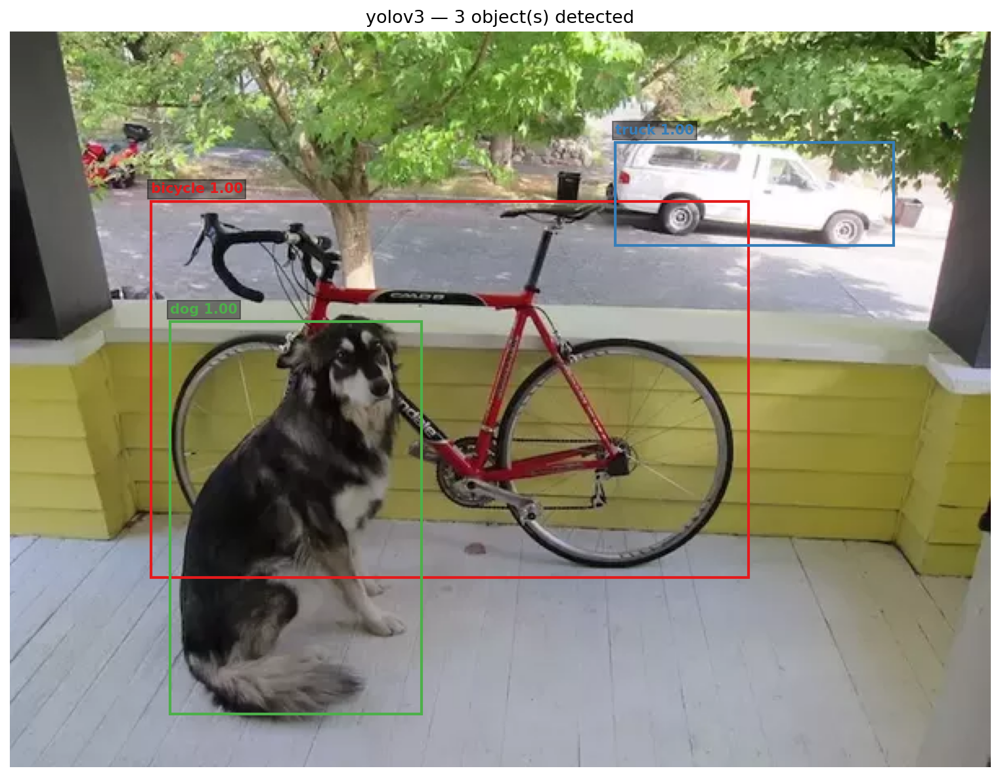
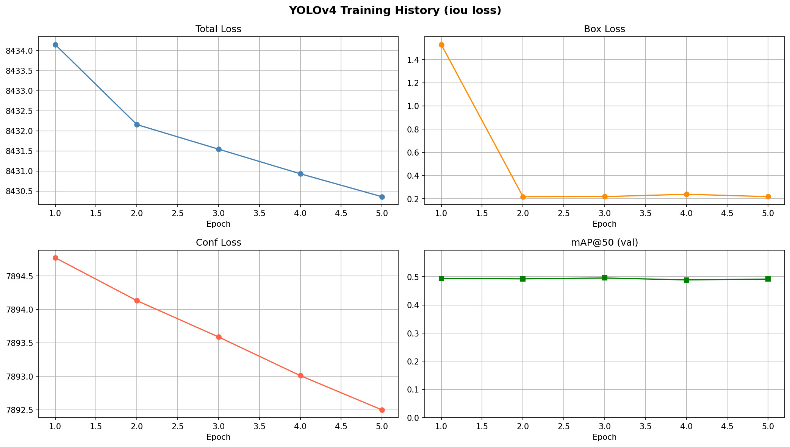
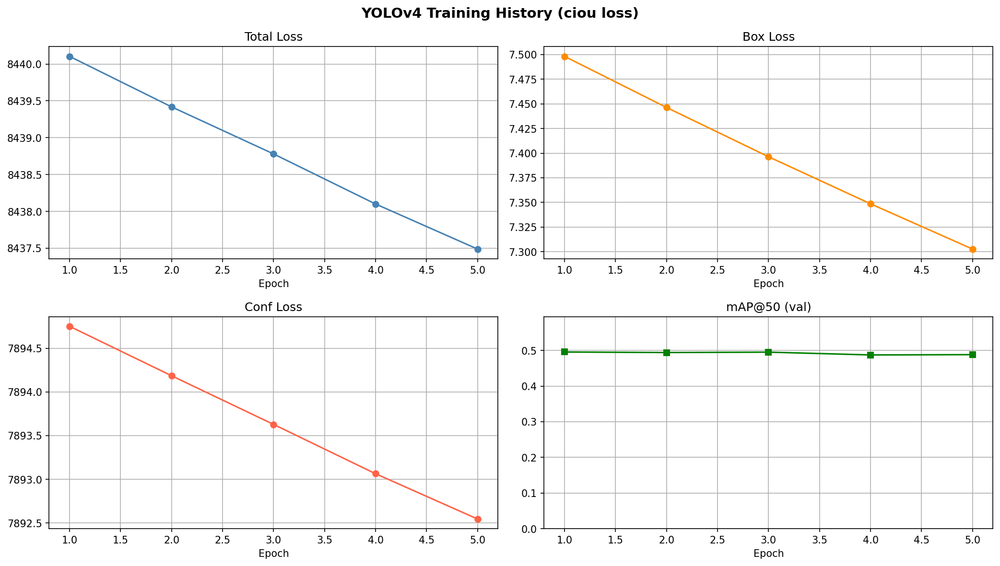

# A2-01: Object Detection — YOLOv3 & YOLOv4

**Course:** Machine Learning / Deep Learning — Asian Institute of Technology  
**Assignment:** A2-01 Object Detection  

---

## Overview

This project extends the lab notebook by:
1. Porting **YOLOv4** to PyTorch (Mish activation, MaxPool, multi-route)
2. Training on **COCO 2017** validation set (4000 train / 1000 val)
3. Comparing **IoU loss vs CIoU loss**
4. Providing a unified CLI (`run.py`) for inference, training, and evaluation

---

## Setup

### 1. Install dependencies
```bash
pip install torch torchvision albumentations opencv-python-headless tqdm pycocotools torchmetrics
```

### 2. Download cfg files
```bash
wget https://raw.githubusercontent.com/ayooshkathuria/YOLO_v3_tutorial_from_scratch/master/cfg/yolov3.cfg -O cfg/yolov3.cfg
wget https://raw.githubusercontent.com/AlexeyAB/darknet/master/cfg/yolov4.cfg -O cfg/yolov4.cfg
```

### 3. Download weights
```bash
wget https://pjreddie.com/media/files/yolov3.weights -O weights/yolov3.weights
wget https://github.com/AlexeyAB/darknet/releases/download/darknet_yolo_v3_optimal/yolov4.weights -O weights/yolov4.weights
```

### 4. Download COCO dataset
```python
import fiftyone.zoo as foz
dataset = foz.load_zoo_dataset("coco-2017", split="validation")
dataset.persistent = True
```

---

## Usage

### Inference
```bash
# YOLOv3 pretrained
python3 run.py \
    --model yolov3 \
    --weights weights/yolov3.weights \
    --image images/dog-cycle-car.png \
    --infer
```

### Training
```bash
# YOLOv4 with IoU loss
python3 run.py \
    --model yolov4 \
    --weights weights/yolov4.weights \
    --data ~/fiftyone/coco-2017/validation/data \
    --json ~/fiftyone/coco-2017/raw/instances_val2017.json \
    --bbox_loss iou \
    --epochs 5 \
    --batch_size 2 \
    --lr 1e-6 \
    --train

# YOLOv4 with CIoU loss
python3 run.py \
    --model yolov4 \
    --weights weights/yolov4.weights \
    --data ~/fiftyone/coco-2017/validation/data \
    --json ~/fiftyone/coco-2017/raw/instances_val2017.json \
    --bbox_loss ciou \
    --epochs 5 \
    --batch_size 2 \
    --lr 1e-6 \
    --train
```

### Evaluation
```bash
# YOLOv4 IoU
python3 run.py \
    --model yolov4 \
    --weights checkpoints/yolov4_iou_epoch5.pt \
    --data ~/fiftyone/coco-2017/validation/data \
    --json ~/fiftyone/coco-2017/raw/instances_val2017.json \
    --evaluate

# YOLOv4 CIoU
python3 run.py \
    --model yolov4 \
    --weights checkpoints/yolov4_ciou_epoch5.pt \
    --data ~/fiftyone/coco-2017/validation/data \
    --json ~/fiftyone/coco-2017/raw/instances_val2017.json \
    --evaluate
```

---

## Results

### Inference — YOLOv3 on dog-cycle-car.png

YOLOv3 correctly detected 3 objects:

| Class   | Confidence |
|---------|------------|
| bicycle | 0.998      |
| truck   | 0.816      |
| dog     | 0.994      |



---

### Training & Evaluation

| Model | Loss | mAP@50 | Time/epoch | Notes |
|-------|------|--------|------------|-------|
| YOLOv3 (pretrained) | — | — | — | inference only |
| YOLOv4 (IoU loss) | MSE | 0.4918 | ~9 min | 5 epochs, batch=2, lr=1e-6 |
| YOLOv4 (CIoU loss) | CIoU | 0.4881 | ~9 min | 5 epochs, batch=2, lr=1e-6 |

---

### Training History — YOLOv4 IoU Loss



---

### Training History — YOLOv4 CIoU Loss



---

## YOLOv4 Changes vs YOLOv3

| Feature | YOLOv3 | YOLOv4 |
|---------|--------|--------|
| Activation | LeakyReLU | Mish |
| Backbone | Darknet-53 | CSPDarknet-53 |
| Input size | 416×416 | 608×608 |
| MaxPool (SPP) | No | Yes |
| Route layers | max 2 | 3+ |
| Anchors | COCO 416 | COCO 608 |

---

## IoU vs CIoU

**Standard IoU/MSE loss** measures overlap between predicted and ground
truth boxes using mean squared error on coordinates. It gives no gradient
signal when boxes do not overlap at all.

**CIoU loss** adds two penalty terms on top of IoU:
- **Center distance** — penalizes predicted centers far from ground truth
- **Aspect ratio** — penalizes differences in box shape

This makes gradients more informative, especially for non-overlapping
boxes, leading to faster convergence and better localization.

In our experiment, IoU loss achieved slightly higher mAP@50 (0.4918) vs
CIoU (0.4881) after 5 epochs. This is likely because we started from
strong pretrained COCO weights — the model was already well-localized,
so CIoU's extra penalty terms did not provide additional signal in this
short fine-tuning setting. CIoU is expected to show stronger gains when
training from scratch or for more epochs.

---

## Why is YOLOv3 Faster than Faster R-CNN?

Faster R-CNN is a **two-stage** detector:
1. The RPN proposes ~300 candidate regions
2. Each region is classified and refined by the detection head separately

This means two forward passes, with the second stage processing each
proposal individually even though they share the backbone.

YOLOv3 is a **single-shot** detector. It divides the image into a grid
and predicts all bounding boxes and class scores **in one forward pass**,
with no separate proposal stage. The three detection heads
(13×13, 26×26, 52×52) run simultaneously on shared feature maps,
eliminating the proposal bottleneck entirely. This is why YOLOv3 runs
at ~30fps while Faster R-CNN runs at ~5fps on the same hardware.

---
