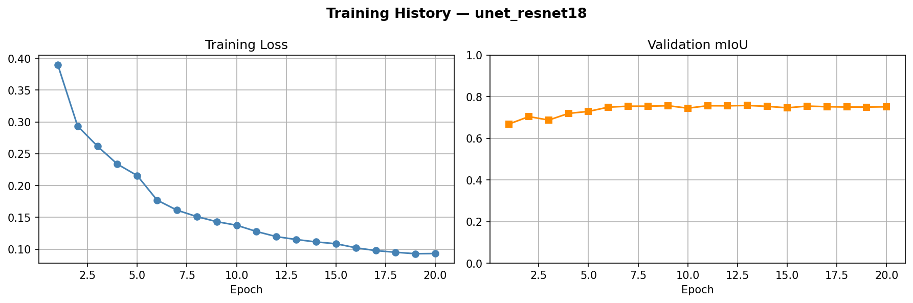
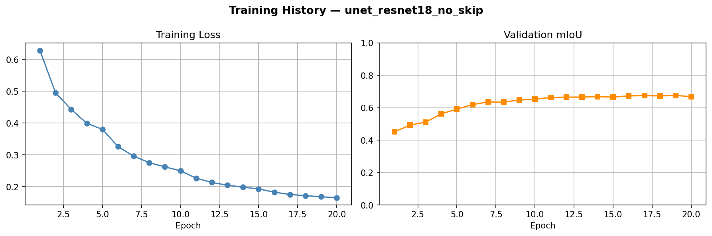
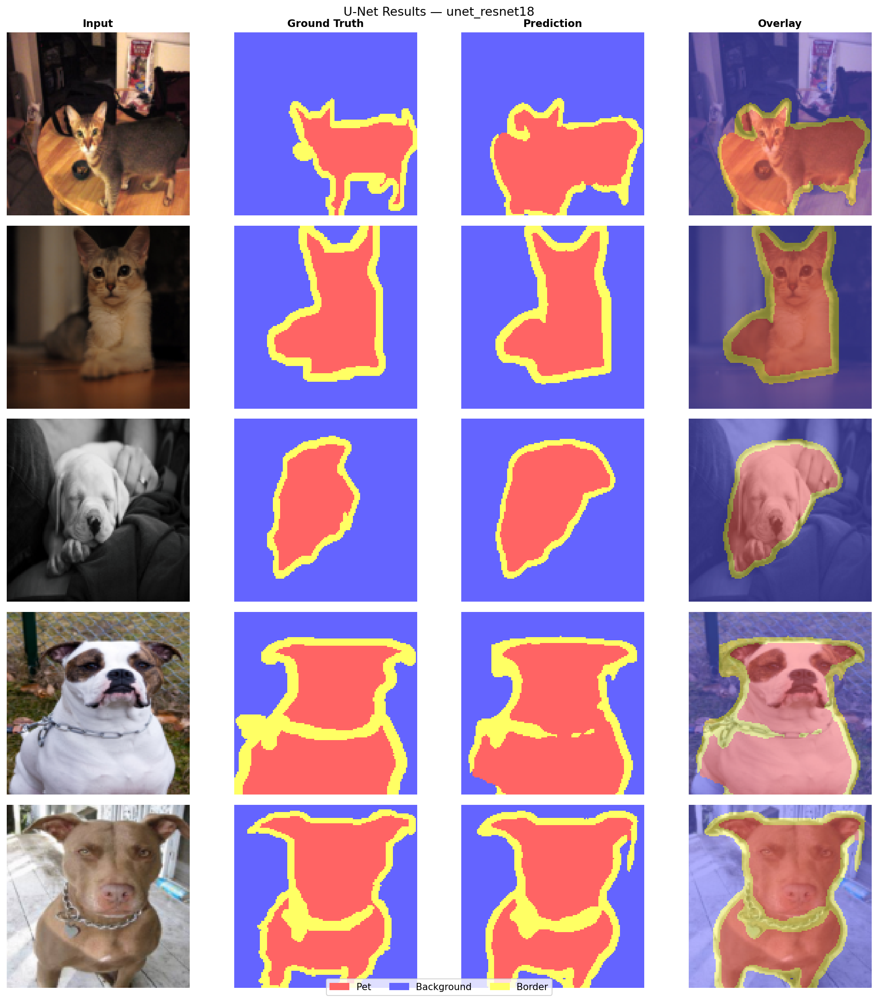
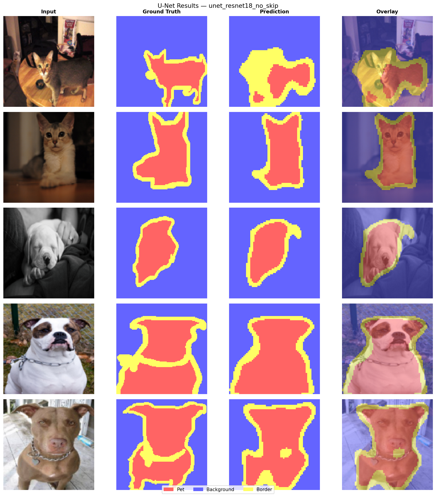

# A2-02: Image Segmentation with U-Net

## Overview

This project implements semantic image segmentation using U-Net on the
Oxford-IIIT Pet dataset. The main experiment compares two variants:

1. **UNet + ResNet-18** — pretrained ResNet-18 encoder with skip connections
2. **UNet + ResNet-18 (no skip)** — same encoder, skip connections removed

The goal is to measure how much skip connections contribute to segmentation
quality (mIoU).

---

## Setup

### Install dependencies
```bash
pip install torch torchvision tqdm matplotlib
```

The Oxford-IIIT Pet dataset is downloaded automatically on first run.

---

## Usage

### Training
```bash
# With skip connections
python3 run.py \
    --model unet_resnet18 \
    --epochs 20 \
    --batch_size 16 \
    --lr 1e-3 \
    --train

# Without skip connections
python3 run.py \
    --model unet_resnet18_no_skip \
    --epochs 20 \
    --batch_size 16 \
    --lr 1e-3 \
    --train
```

### Evaluation
```bash
python3 run.py --model unet_resnet18         --evaluate
python3 run.py --model unet_resnet18_no_skip --evaluate
```

### Visualize Predictions
```bash
python3 run.py --model unet_resnet18         --visualize
python3 run.py --model unet_resnet18_no_skip --visualize
```

---

## Results

### Training Summary

| Model | Encoder | Best mIoU | Best Epoch | Time/epoch |
|-------|---------|-----------------| ------------|------------|
| UNet + ResNet-18 | ResNet-18 (ImageNet) | 0.7582 | 13 | ~21s |
| UNet + ResNet-18 (no skip) | ResNet-18 (ImageNet) | 0.6763 | 19 | ~20s |

### Test Evaluation

| Model | mIoU@test |
|-------|-----------|
| UNet + ResNet-18 (with skip) | 0.7582 |
| UNet + ResNet-18 (no skip)   | 0.6763 |
| **Difference** | **+0.0819** |

---

### Training History — With Skip Connections



---

### Training History — Without Skip Connections



---

### Prediction Visualizations — With Skip Connections



---

### Prediction Visualizations — Without Skip Connections



---
### Skip Connection vs No Skip

| Stage | With Skip | Without Skip |
|-------|-----------|--------------|
| dec4 input | 512 + 512 = 1024ch | 512ch |
| dec3 input | 256 + 256 = 512ch  | 256ch |
| dec2 input | 128 + 128 = 256ch  | 128ch |
| dec1 input | 64 + 64 = 128ch    | 64ch  |
| dec0 input | 32 + 64 = 96ch     | 32ch  |

---

## Discussion

Skip connections improved mIoU by **0.0819** (0.7582 vs 0.6763) an
improvement of about 10.8% relative to the no-skip baseline. This confirms
that skip connections are critical for segmentation tasks.

The reason skip connections help segmentation more than classification is
that segmentation requires knowing both **what** (semantic content) and
**exactly where** (precise pixel boundaries). Deep features from the
bottleneck capture what object is present but lose spatial precision due
to repeated downsampling. Skip connections bring high-resolution encoder
features directly to each decoder stage, providing fine-grained boundary
and edge information that the decoder could not reconstruct from the
bottleneck alone.

The first skip connection (64ch, highest resolution, s0) likely contributes
most to boundary accuracy since it operates at H/2 resolution and captures
the finest spatial detail. The last skip connection (512ch, s4) contributes
more to semantic consistency helping the decoder know which object class
it is refining but at very low resolution (4×4) its spatial contribution
is minimal.

U-Net is preferable over Mask R-CNN when the task is **semantic
segmentation** (all pixels, no instance separation needed), when compute
is limited (U-Net is much lighter), or when objects don't have clear
instance boundaries (e.g. road, sky, vegetation). Mask R-CNN is better
when individual object instances must be separated.