# A4: Generative Models

This assignment implements three generative model families — Vanilla GAN, CycleGAN, and DDPM — and compares their behavior through training experiments and ablation studies.

---

## Commands Used

```bash
# Train Vanilla GAN on MNIST
python3 run.py --model gan --dataset mnist --epochs 20 --train

# Train CycleGAN on CelebA
python3 run.py --model cyclegan --dataset celeba --epochs 20 --train

# Train DDPM on MNIST (linear schedule)
python3 run.py --model ddpm --dataset mnist --epochs 20 --train --schedule linear

# Train DDPM on MNIST (cosine schedule)
python3 run.py --model ddpm --dataset mnist --epochs 20 --train --schedule cosine

# Test CycleGAN with own face
python3 run.py --model cyclegan --weights saved/cyclegan_celeba.pt --test-image my_face.jpg

# Generate DDPM samples from saved weights
python3 run.py --model ddpm --weights saved/ddpm_mnist_linear.pt --generate --n 64

# Exercise 1b: cause mode collapse
python3 run.py --model gan --epochs 20 --train --d-lr 6e-4

# Exercise 2: CycleGAN without cycle loss
python3 run.py --model cyclegan --dataset celeba --epochs 10 --train --lambda-cyc 0
```

---

## Results Table

| Model | Dataset | Final Loss | Training Time | Notes |
|---|---|---|---|---|
| Vanilla GAN | MNIST | G: 1.360, D: 0.987 | ~8s/epoch | All 10 digits covered |
| CycleGAN | CelebA | G: 2.993, D: 0.381 | ~236s/epoch | Dark ↔ Blonde |
| DDPM (linear) | MNIST | 0.026 | ~25s/epoch | Baseline schedule |
| DDPM (cosine) | MNIST | 0.040 | ~25s/epoch | Schedule ablation |

---

## Visualizations

### GAN — Generated MNIST (Epoch 20)
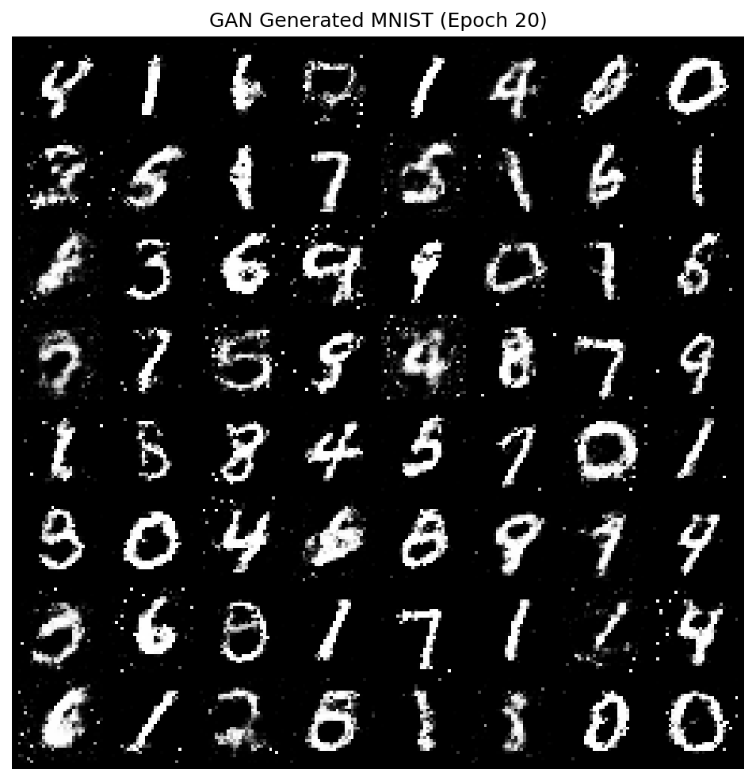

### GAN — Training Losses
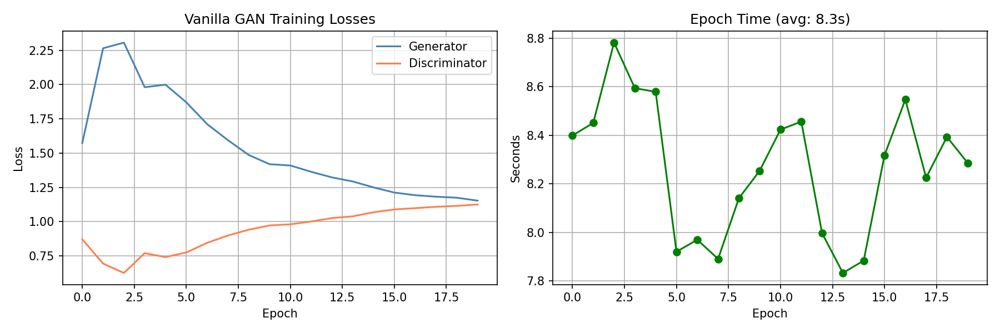

### CycleGAN — Dark ↔ Blonde Translation Grid
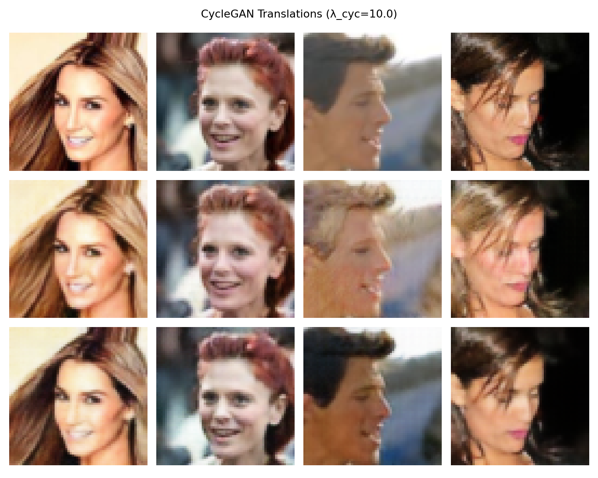

### CycleGAN — Training Losses
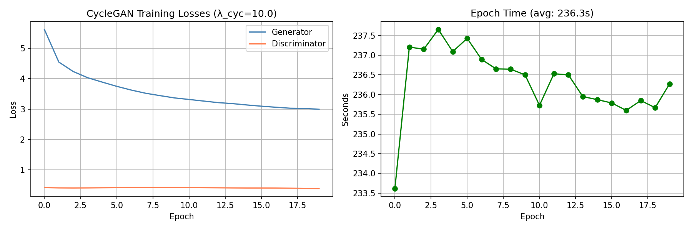

### My Face — Style Transfer Result
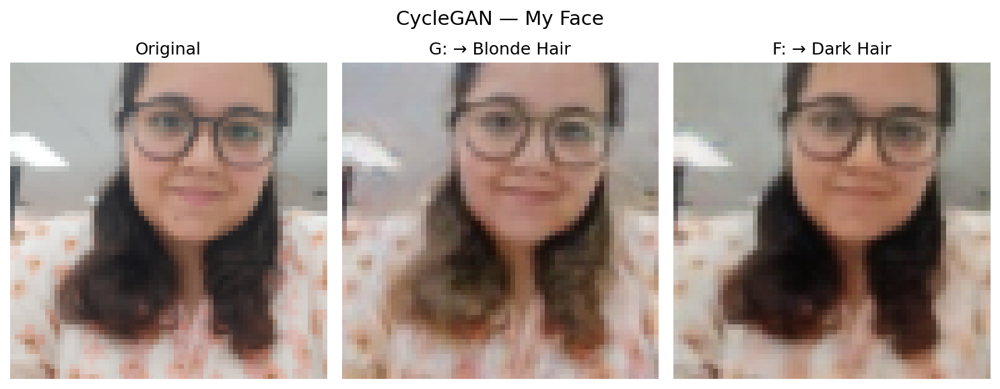

### DDPM — Denoising Trajectory (Linear Schedule)
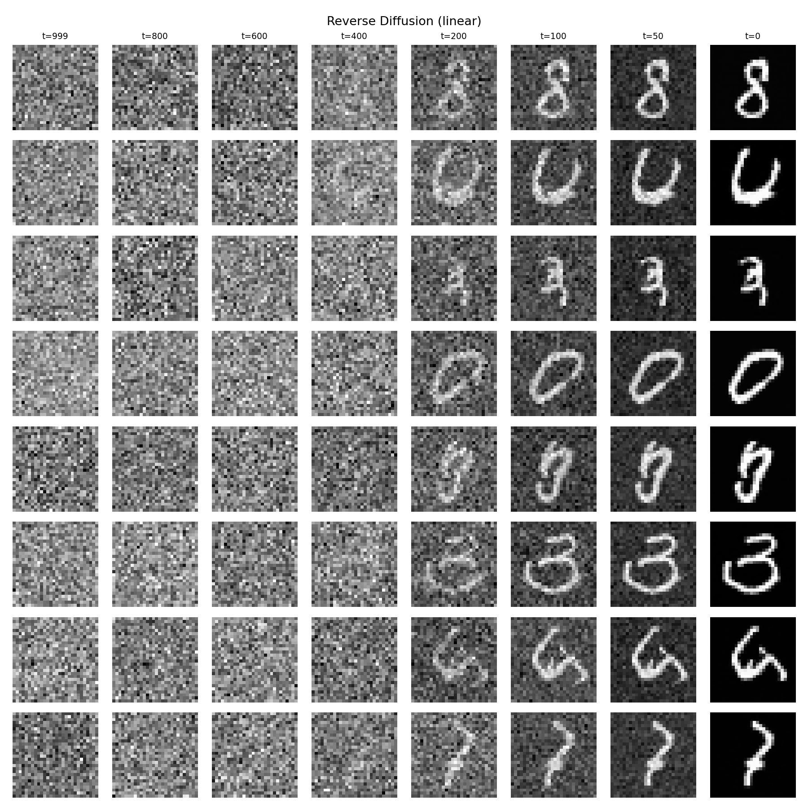

### DDPM — Generated Samples Comparison
| Linear Schedule | Cosine Schedule |
|---|---|
| 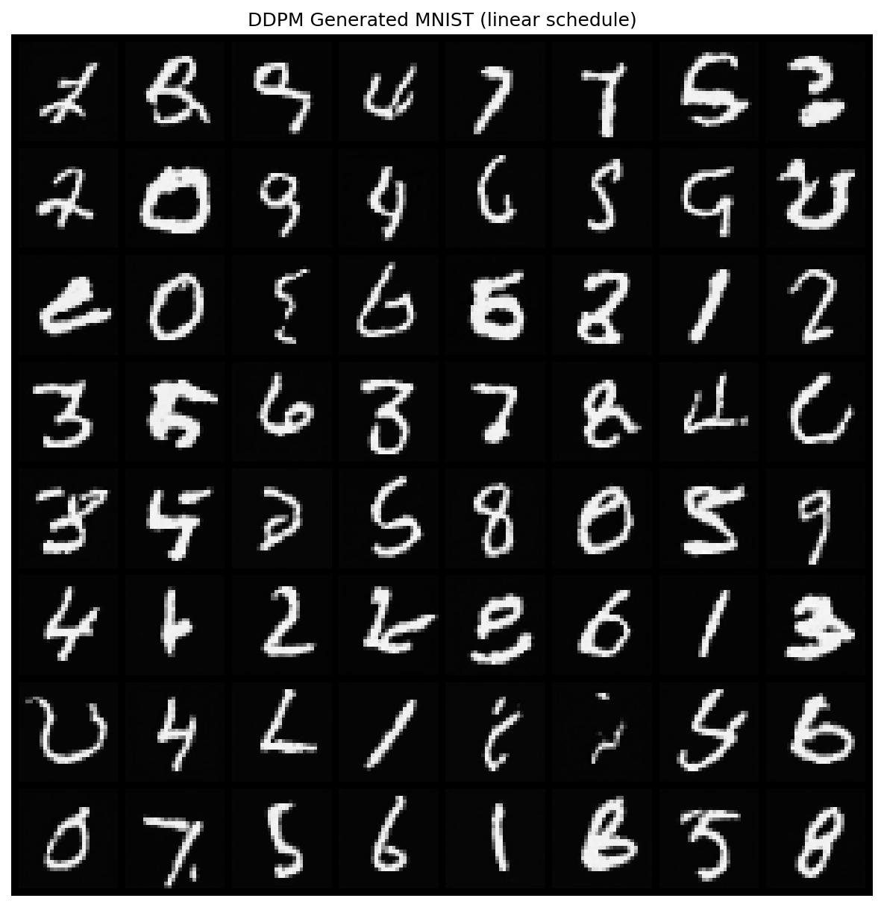 | 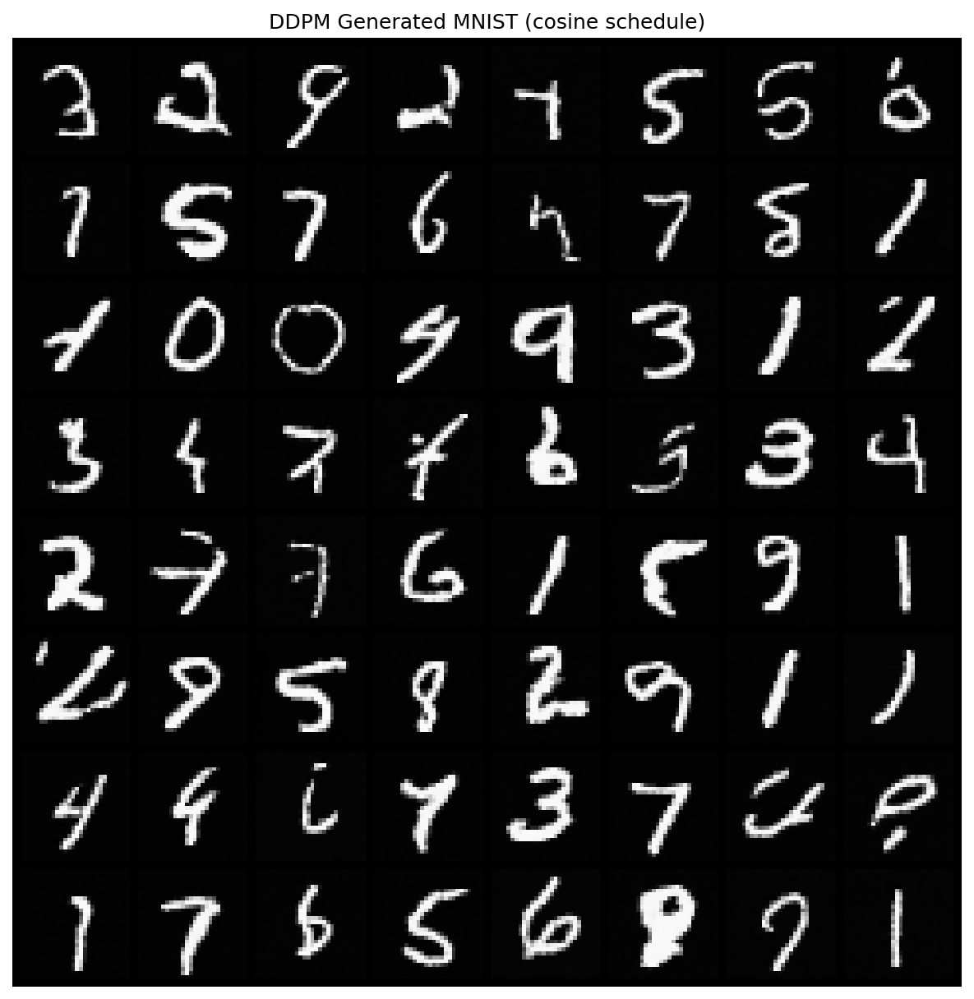 |

### DDPM — Loss Curves Comparison
| Linear Schedule | Cosine Schedule |
|---|---|
| 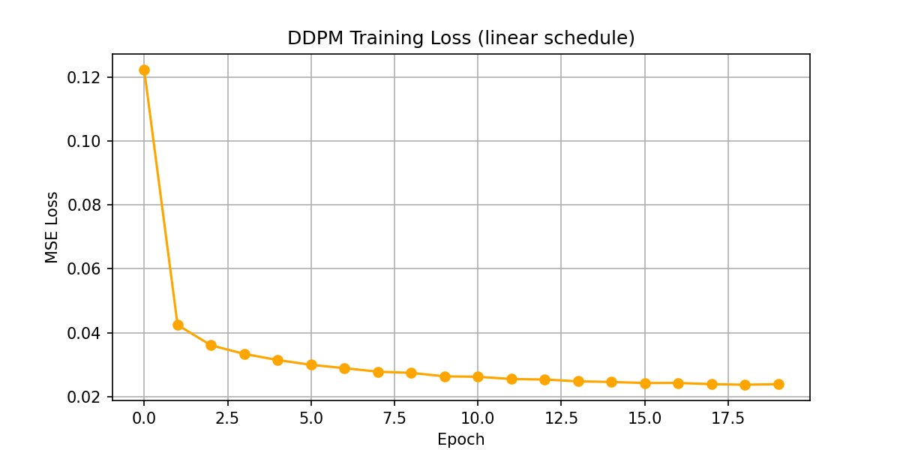 | 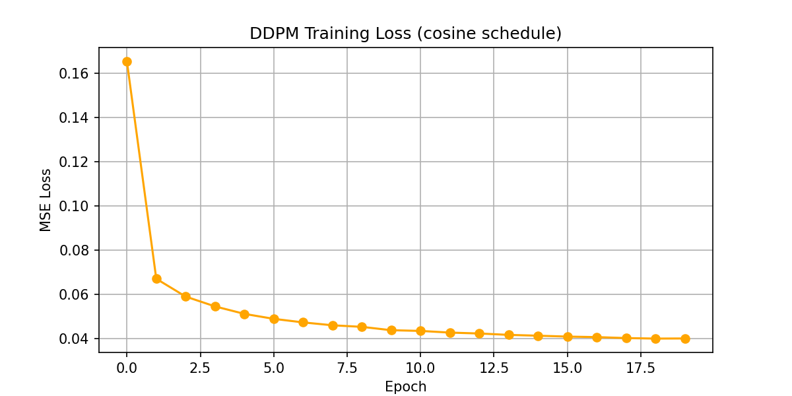 |

---

## Exercise 1: GAN Mode Collapse

### 1a) Digit Distribution (Default GAN, 1000 generated images)

| Digit | 0 | 1 | 2 | 3 | 4 | 5 | 6 | 7 | 8 | 9 |
|---|---|---|---|---|---|---|---|---|---|---|
| Count | 101 | 130 | 51 | 65 | 115 | 79 | 63 | 175 | 96 | 125 |

The default GAN covers all 10 digits, though not evenly. Digit 7 is the most generated (175/1000) and digit 2 is the least (51/1000). This is mild imbalance rather than full collapse — the generator has learned to represent the full digit space.


### 1b) Digit Distribution (Collapse GAN, d-lr=6e-4, 1000 generated images)

| Digit | 0 | 1 | 2 | 3 | 4 | 5 | 6 | 7 | 8 | 9 |
|---|---|---|---|---|---|---|---|---|---|---|
| Count | 45 | 164 | 84 | 135 | 102 | 80 | 56 | 153 | 74 | 107 |

With a 3× higher discriminator learning rate, the distribution becomes more skewed. Digit 0 dropped to just 45 samples and digit 6 to 56, while digits 1 and 7 dominate. The discriminator learns too fast, leaving the generator chasing a moving target and collapsing toward modes it can most easily fool.


### 1c) Techniques to Prevent Mode Collapse

**Wasserstein GAN (WGAN):** Replaces the BCE loss with the Wasserstein distance, which provides a smoother gradient signal even when the discriminator is very confident. This removes the vanishing gradient problem that causes the generator to stop exploring new modes.

**Minibatch Discrimination:** The discriminator receives statistics computed across a batch of generated images, not just individual samples. This allows it to detect when the generator is producing near-identical outputs, directly penalizing mode collapse.

---

## Exercise 2: CycleGAN Ablation — Cycle Consistency

### 2a) Translation Quality Comparison

| Setting | Visual quality | Face structure preserved? | Notes |
|---|---|---|---|
| λ_cyc = 10 (default) | Good | Yes — eyes, nose, background intact | Hair color changes, face unchanged |
| λ_cyc = 0 (disabled) | Poor | No — face structure distorts | Generator ignores content, only style |

### 2b) Observations

| Default (λ_cyc = 10) | No Cycle Loss (λ_cyc = 0) |
|---|---|
|  | 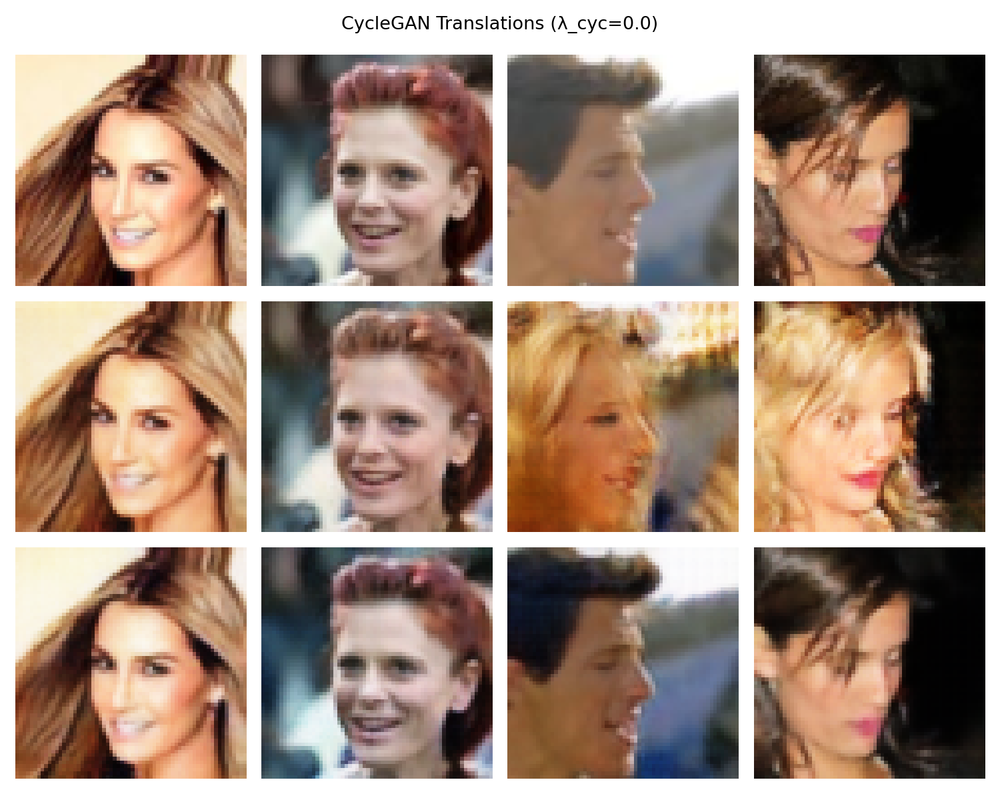 |

With λ_cyc = 10, translations change hair color while preserving facial features and background. With λ_cyc = 0, the generator produces blurry, distorted outputs — faces lose structure and the background changes unpredictably.

### 2c) Why Removing Cycle Consistency Causes Cheating

Without the cycle constraint, there is nothing stopping the generator from mapping every input to the same output — for example, mapping all dark-hair images to a single convincing blonde face. The generator only needs to fool the discriminator, not preserve the original content. Cycle consistency forces the translation to be invertible: if G translates x → y, then F must be able to recover x from y. This prevents the generator from discarding input information and forces it to make minimal, targeted changes.

---

## Exercise 3: Own Face — Style Transfer

### 3a) Result


Three-panel result: original face | G: → Blonde Hair | F: → Dark Hair.

### 3b) Face Structure Preservation

The model partially preserved facial structure — the eyes, glasses, and nose position remain recognizable in both translations. This is due to the identity loss term (λ_idt = 5), which penalizes the generators if they change an image that is already in the target domain. This encourages color-only changes rather than structural deformations. The cycle consistency loss also indirectly preserves structure by requiring the translation to be invertible.

### 3c) Distribution Shift

The model was trained on 64×64 celebrity photos from CelebA, which have consistent studio-like lighting, centered face framing, and a specific demographic distribution. A personal photo with different lighting, angle, or background falls outside this distribution. In my case, the model still performed a recognizable hair color shift, but the output is blurry and the background was slightly altered — typical artifacts when the input is somewhat out-of-distribution. The 64×64 resolution limits detail regardless of distribution shift.

---

## Exercise 4: DDPM Noise Schedule Ablation

### 4a) Noise Schedule Curves (ᾱ_t)

The plots below show training loss curves for both schedules. The cosine schedule keeps ᾱ_t higher for longer, meaning the image is destroyed more slowly in the early timesteps.

| Linear Loss | Cosine Loss |
|---|---|
|  |  |

### 4b) Schedule Comparison

| Schedule | Loss at epoch 20 | Visual quality (1–5) | Notes |
|---|---|---|---|
| Linear | 0.026 | 4 | Sharp digits, good diversity |
| Cosine | 0.040 | 3 | Slightly softer but stable |

### 4c) Generated Samples

| Linear Schedule | Cosine Schedule |
|---|---|
|  |  |

The linear schedule achieves lower final loss. The cosine schedule has higher loss because it preserves more signal early in the forward process, making the denoising task harder at low timesteps. On simple 28×28 MNIST both schedules perform comparably, but the cosine schedule's advantage becomes more pronounced on complex, high-resolution datasets where the linear schedule destroys structure too aggressively in early steps.

### DDPM Denoising Trajectory


---

## Discussion

For a real-world image synthesis task, the choice of model depends on the constraints of the problem. GANs are best when speed matters — they train fast and produce sharp outputs, but require careful tuning to avoid mode collapse, making them risky for diverse, complex distributions. CycleGAN is the right tool when the goal is domain translation without paired examples (e.g., style transfer, medical image synthesis), as long as the domains are visually related. Diffusion models are the best choice when output quality and diversity are the top priority and sampling speed is acceptable — they are stable to train, avoid mode collapse entirely, and currently produce the highest-quality results on complex datasets. For production use cases where latency matters, distilled diffusion models (e.g., consistency models) can close the speed gap.
