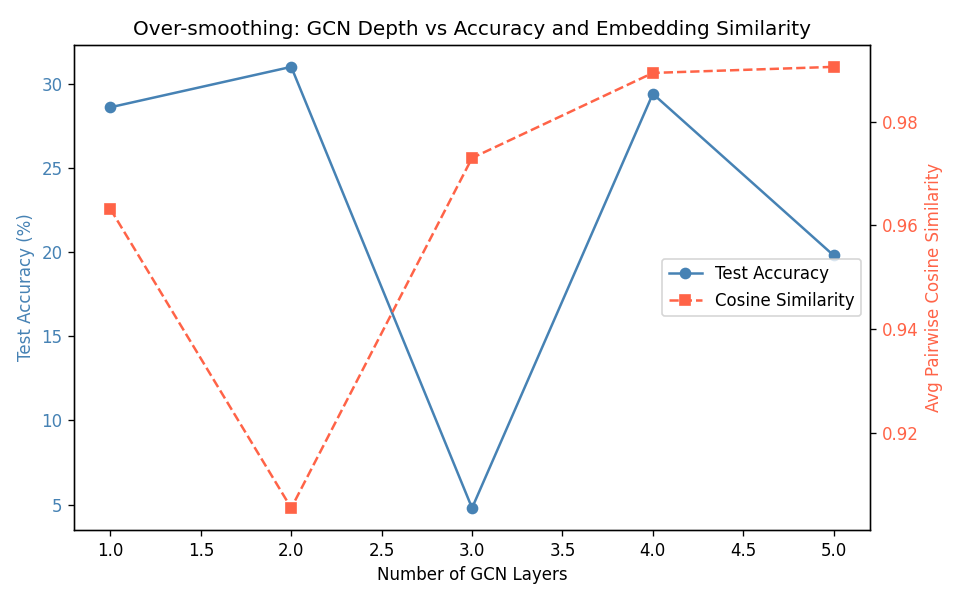
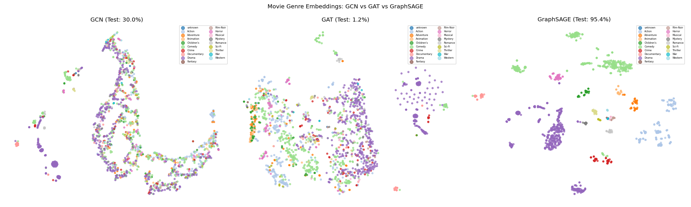
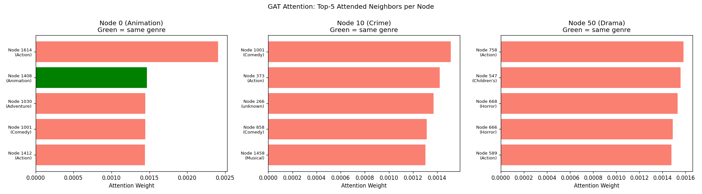

# A5: Graph Neural Networks

Implementation of GCN, GAT, GraphSAGE, and MLP from scratch on the MovieLens-100k co-rating graph for movie genre prediction.

## How to Run

```bash
# Individual models
python3 run.py --model gcn --epochs 200
python3 run.py --model gat --epochs 200
python3 run.py --model sage --epochs 200

# All exercises
python3 run.py --ex1 --epochs 200
```

## Results

### Exercise 1: Over-smoothing Analysis

| # Layers | Test Accuracy | Avg Cosine Similarity |
|----------|--------------|----------------------|
| 1        | 28.60%       | 0.9631               |
| 2        | 31.00%       | 0.9054               |
| 3        | 4.80%        | 0.9730               |
| 4        | 29.40%       | 0.9894               |
| 5        | 19.80%       | 0.9906               |



Accuracy peaks at 2 layers then collapses at 3. Cosine similarity rises steadily from layer 2 onward, confirming that deeper GCNs push all node embeddings toward the same vector. Mechanically, each layer replaces a node's representation with a weighted average of its neighbors. With average degree ~499 in this graph, even one extra layer mixes in an enormous neighborhood — by layer 3, every node has effectively aggregated the entire graph and all embeddings converge, erasing the class-discriminative signal.

### Exercise 2: GCN vs GAT vs GraphSAGE

| Model      | Test Accuracy | Avg Epoch Time |
|------------|--------------|----------------|
| GCN        | 30.00%       | 5ms            |
| GAT        | 1.20%        | 56ms           |
| GraphSAGE  | 95.40%       | 1162ms         |



**Attention Visualization (GAT):**



GAT's attention weights were examined for 3 sample nodes. Top-attended neighbors do not consistently share the same genre label, which explains GAT's poor performance — on a dense graph with average degree 499, the O(N²) attention computation becomes numerically unstable and the softmax spreads weight too thinly to learn meaningful per-edge scores.

**When does each model win?**

GAT outperforms GCN by the largest margin on sparse graphs with heterogeneous neighbor quality — for example a citation network where only a few references are truly relevant. The attention mechanism can learn to downweight noisy edges, but this advantage disappears on dense graphs where softmax over hundreds of neighbors approaches uniform weighting.

GraphSAGE outperforms GCN when the graph is large and dense and inductive generalization matters. By sampling a fixed k neighbors and concatenating self with aggregated neighbors, it avoids the degree-imbalance problem that hurts GCN and scales to graphs where storing the full adjacency matrix is infeasible.

### Exercise 3: MLP Baseline

| Model          | Test Accuracy |
|----------------|--------------|
| MLP (no graph) | 96.20%       |
| GCN            | 30.00%       |
| GAT            | 1.20%        |
| GraphSAGE      | 95.40%       |

The MLP outperforms all GNNs by up to 66 percentage points. This is because the node features — genre one-hot vectors and release year — are already almost perfectly predictive of the genre label (since the label itself is derived from those same features). Graph structure adds no new information here; neighboring movies share genres because users rate similar films, but the features already encode that directly. This result is a useful reminder that GNNs are not universally better than MLPs — they only help when relational structure carries signal beyond what node features alone provide.

## Discussion: When to Use a GNN Instead of an MLP

Use a GNN when the graph structure itself carries predictive signal that node features alone cannot capture. A concrete example from biology: in protein-protein interaction networks, a protein's function can be inferred from the functions of its interaction partners even when its own sequence features are ambiguous — an MLP would miss this entirely, while a GNN propagates functional signals across interaction edges to resolve ambiguous nodes. Similarly in traffic routing, a road segment's travel time depends on congestion upstream, which is a graph-structural dependency that no per-node feature can encode without message passing.

## Student ID
jupyter-st126222
