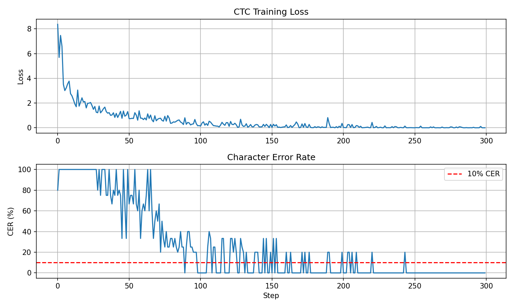
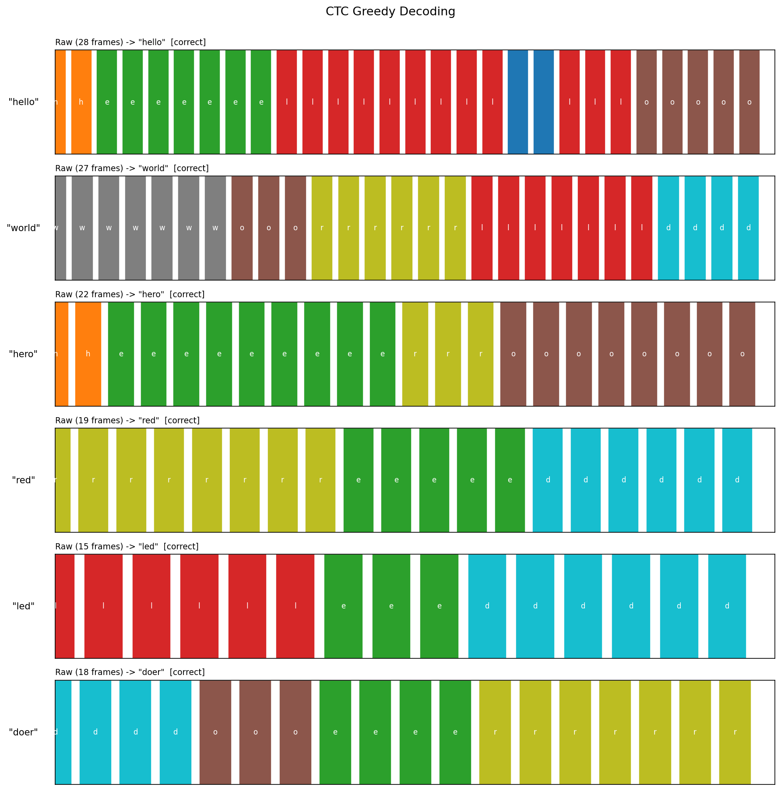
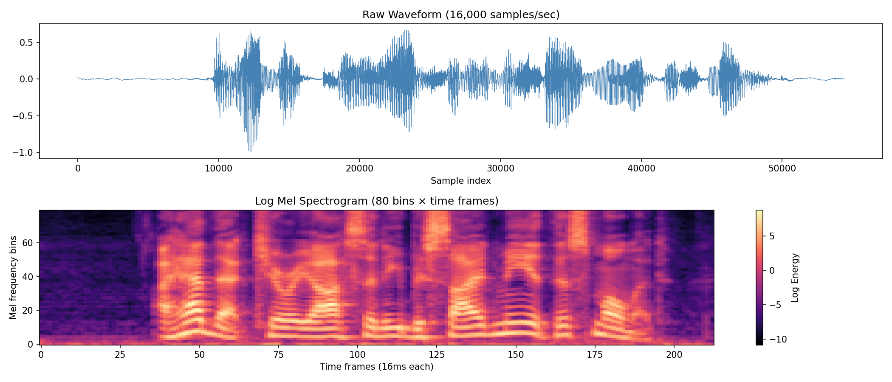
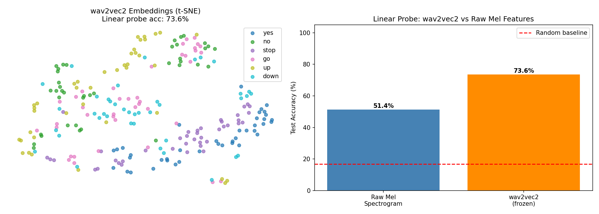
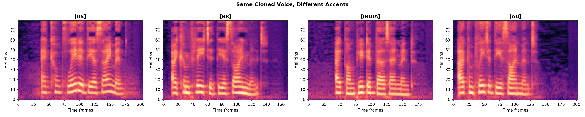
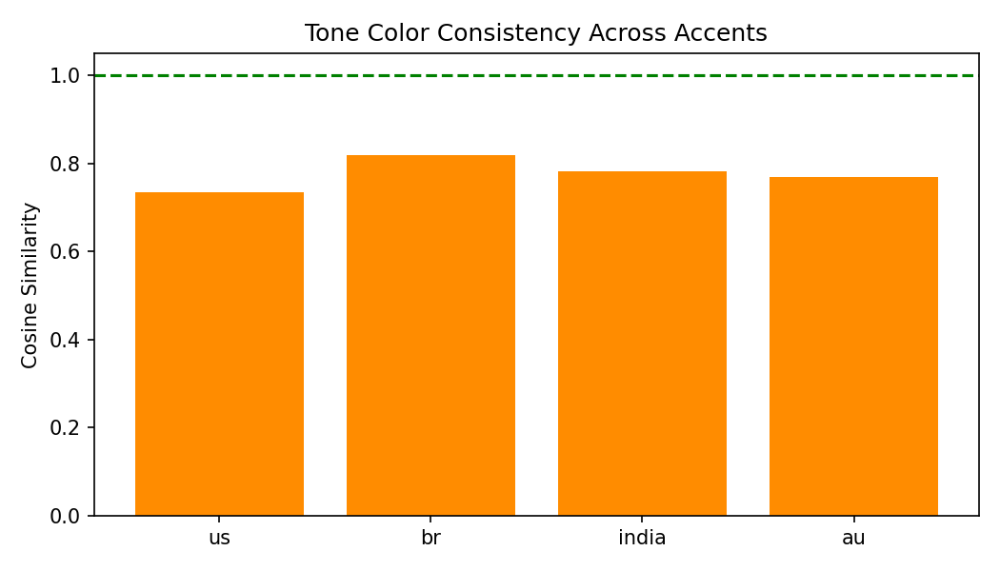

# A6: Speech Processing

A full speech pipeline covering tokenization, mel spectrograms, CTC alignment, self-supervised speech encoders, and voice cloning.

---

## Commands Used

```bash
# Part 1 — Tokenizer
python3 run.py --model tokenizer

# Part 2 — Mel Spectrogram
python3 run.py --model melspectrogram

# Part 3 — CTC
python3 run.py --model ctc --epochs 300

# Part 4 — wav2vec2 linear probe (4 classes)
python3 run.py --model wav2vec2-probe --classes yes,no,stop,go

# Part 4 — Exercise 3c (6 classes)
python3 run.py --model wav2vec2-probe --classes yes,no,stop,go,up,down

# Part 5 — Voice cloning
python3 run.py --model voice-clone --extract-se --reference data/voice_clone/my_voice.wav
python3 run.py --model voice-clone --generate --accent all --text "I completed the assignment!"
python3 run.py --model voice-clone --cross-lingual --language ALL
python3 run.py --model voice-clone --cosine-sim
```

---

## Results

### Exercise 1 — Speech Tokenizer

| Sentence | # Char tokens | # Total tokens | Accent Tag |
|---|---|---|---|
| Hello, how are you? | 19 | 21 | — |
| Dr. Smith prescribed 10 tablets. | 36 | 38 | — |
| [EN-US] I got the job! | 14 | 17 | [EN-US] (id=36) |
| [EN-BR] I lost my wallet. | 17 | 20 | [EN-BR] (id=37) |
| [EN-INDIA] This is completely unacceptable! | 32 | 35 | [EN-INDIA] (id=38) |

Vocabulary size: 41 (36 chars + 3 special tokens + 5 accent tags).

**Exercise 1b — Why normalization matters:** `"Dr."` is ambiguous — a model seeing it as raw characters has no way to know it expands to `"doctor"`. Without normalization the TTS decoder would try to pronounce the abbreviation directly, producing garbled or silent output. Expanding abbreviations and numbers into their spoken forms before encoding ensures the character sequence actually corresponds to how the text is said aloud.

**Exercise 1c — Architectural similarity between `[CLS]` and `[EN-US]`:** Both are single tokens prepended to the sequence whose embedding is learned end-to-end. In BERT, `[CLS]` gets attended to by every other token and its final hidden state aggregates global sequence meaning. In the speech tokenizer, `[EN-US]` conditions the entire decoder in the same way — every downstream frame attends to it and picks up the accent's phonetic and prosodic style. A single token can influence the whole output because attention is global: once the embedding is in the context, every position can use it.

---

### Exercise 2 — CTC

**2a — Collapsing function:**

| Alignment | Collapsed |
|---|---|
| HHEELLLLOO | HELO |
| H_EE_LL_LO | HELLO |
| H_E_L_L_O | HELLO |
| HHHHEEEELLLLLLOOOO | HELO |

The blank token is essential: without it `HELLLO` would collapse to `HELO` regardless of whether those frames represent one stretched L or two distinct Ls. The blank in `L ε L` tells the collapsing function these are separate occurrences.

**2b — Forward algorithm:**

| Target | log P_CTC | P_CTC |
|---|---|---|
| HEL | -5.5957 | 0.003714 |
| LEH | -7.0833 | 0.000839 |

Different probabilities because the model's per-frame softmax distributions assign different weights to each character at each timestep. `HEL` fits the model's random output better than `LEH` at those specific frames.

**2c — Character Error Rate:**

CER first dropped below 10% at **step 79**. By step 150 it was 4.4%, converging near 0% by step 200.



**2d — Short character durations (`frames_per_char=(1,2)`):** Accuracy gets worse. With only 1–2 frames per character, the model has almost no temporal context to agree on a prediction before moving to the next character. CTC relies on repeating a prediction across several frames so the greedy argmax produces a clear dominant character — with very short durations, predictions are noisy and the collapsing function has little to work with.



---

### Exercise 3 — wav2vec2 vs Raw Mel Spectrogram

#### Part 2 — Mel Spectrogram



#### Linear Probe Results

| Feature | 4-class accuracy | 6-class accuracy |
|---|---|---|
| Raw mel-spectrogram (mean-pooled) | 68.8% | 51.4% |
| wav2vec2 (frozen, mean-pooled) | 85.4% | 73.6% |
| Random baseline | 25.0% | 16.7% |

wav2vec2 improvement: **+16.7%** (4 classes), **+22.2%** (6 classes).



**3b — Comparison with SSL lab:** The +16–22% gap from wav2vec2 over raw mel features is comparable in magnitude to the gap seen between raw pixel features and pretrained SSL encoders (SimCLR/DINO/MAE) in the image SSL lab. Self-supervised pretraining provides a similar quality boost in both modalities. The comparison is not entirely fair given different data modalities and tasks, but the consistent theme is that pretraining on unlabeled data yields representations substantially more useful than hand-crafted features.

**3c — 6-class probe:** Accuracy dropped from 85.4% → 73.6% going from 4 to 6 classes, but remained well above the new random baseline (16.7%). The drop is sub-proportional to the increase in classes, confirming wav2vec2 representations scale gracefully to harder discrimination tasks.

**3d — Contrastive vs reconstruction:** wav2vec2 uses a contrastive loss against quantized targets; MAE uses reconstruction. Both produce strong representations, but contrastive methods push representations to be discriminative (useful for classification probes), while reconstruction methods preserve fine-grained signal detail. For spoken word classification, the contrastive bias of wav2vec2 is well-matched to the task.

---

### Exercise 4 — Voice Cloning

**4a — Mel spectrogram grid (same cloned voice, 4 accents):**



Despite the same tone color embedding being applied to all four outputs, the mel spectrograms show visibly different temporal patterns — rhythm, pace, and formant trajectories vary by accent, confirming that OpenVoice's disentanglement preserves style differences while holding tone color constant.

**4b — Cosine similarity (reference vs cloned outputs):**

| Accent | Cosine Similarity |
|---|---|
| us | 0.7355 |
| br | 0.8188 |
| india | 0.7813 |
| au | 0.7691 |



All four similarities are high (0.73–0.82) and within a narrow range — the tone color is largely preserved across accents. The small variation is likely because different accent prosody affects how the tone color extractor perceives the short generated clip compared to the longer reference recording.

**Cross-lingual cloning:** EN, ES (Spanish), and FR (French) outputs were generated from the same tone color embedding extracted from an English reference recording. The model successfully applied the cloned voice timbre to languages never present in the reference clip, demonstrating that tone color embeddings are language-agnostic.

---

## Discussion

Understanding speech tokenization and CTC alignment changes how you think about ASR and TTS in a fundamental way: the core challenge is not "what does this word mean" but "where in time does this sound live." CTC's insight — sum over all valid alignments rather than committing to one — makes training tractable without needing pre-aligned data. For TTS, the inverse problem (stretching discrete tokens to continuous frames) requires either learned attention (Tacotron) or an explicit duration predictor (FastSpeech), both solutions to the same alignment problem from the other direction.

A tone color embedding is fundamentally different from a text token or a CTC blank even though all three condition the model. A text token is a discrete symbol from a fixed vocabulary carrying linguistic meaning. A CTC blank is a structural marker that exists only to resolve the collapse ambiguity with no acoustic content. A tone color embedding is a continuous vector extracted from real audio encoding acoustic identity — timbre, vocal tract shape, pitch range — with no linguistic content whatsoever. The three objects live in completely different spaces — symbolic, structural, and acoustic — and the fact that all three can be represented as vectors fed into a neural network is what makes the modern speech stack so flexible.